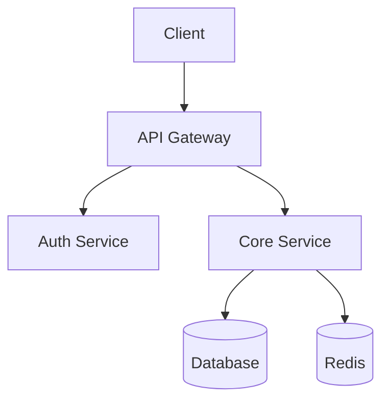
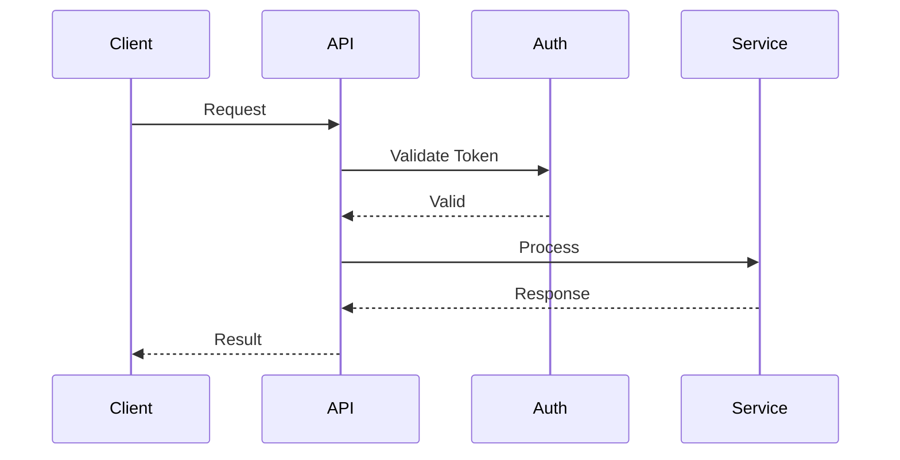

# Technical Specification Skill

## Overview

This skill guides creation of technical specification documents (tech specs, design docs, RFCs) following company standards and templates.

## When to Use This Skill

- Designing new features or systems
- Proposing architectural changes
- Writing RFCs (Request for Comments)
- Documenting technical decisions
- Planning major refactoring

## Tech Spec Template

### Document Structure

```markdown
# [Feature/System Name] - Technical Specification

**Author**: [Name]
**Reviewers**: [Names]
**Status**: Draft | In Review | Approved | Implemented
**Created**: [Date]
**Last Updated**: [Date]

---

## 1. Overview

### 1.1 Summary
[2-3 sentences describing what this spec proposes]

### 1.2 Goals
- [Primary goal]
- [Secondary goal]

### 1.3 Non-Goals
- [Explicitly out of scope]

---

## 2. Background

### 2.1 Current State
[Describe how things work today]

### 2.2 Problem Statement
[What problem are we solving?]

### 2.3 Why Now?
[Why is this the right time?]

---

## 3. Proposed Solution

### 3.1 High-Level Design
[Architecture overview with diagram]

### 3.2 Detailed Design

#### 3.2.1 [Component 1]
[Detailed description]

#### 3.2.2 [Component 2]
[Detailed description]

### 3.3 Data Model
[Database schema, data structures]

### 3.4 API Design
[API endpoints, contracts]

---

## 4. Alternatives Considered

### 4.1 [Alternative 1]
- **Description**: [What is it]
- **Pros**: [Advantages]
- **Cons**: [Disadvantages]
- **Why not chosen**: [Reason]

### 4.2 [Alternative 2]
[Same format]

---

## 5. Implementation Plan

### 5.1 Phases
| Phase | Description | Duration |
|-------|-------------|----------|
| 1 | [Description] | [Time] |
| 2 | [Description] | [Time] |

### 5.2 Dependencies
- [External dependency]
- [Team dependency]

### 5.3 Rollout Strategy
[How will this be deployed?]

---

## 6. Operational Considerations

### 6.1 Monitoring & Alerting
[What metrics/alerts needed]

### 6.2 Rollback Plan
[How to revert if issues]

### 6.3 Performance
[Expected performance characteristics]

---

## 7. Security & Privacy

### 7.1 Security Considerations
[Security implications]

### 7.2 Privacy Considerations
[Data privacy implications]

---

## 8. Testing Strategy

### 8.1 Unit Tests
[Coverage expectations]

### 8.2 Integration Tests
[Integration test plan]

### 8.3 Load Testing
[Performance testing plan]

---

## 9. Open Questions
- [ ] [Question 1]
- [ ] [Question 2]

---

## 10. References
- [Link to related docs]
- [Link to related specs]
```

## Writing Guidelines

### 1. Be Specific
- Include concrete examples
- Use actual numbers where possible
- Reference specific files/services

### 2. Consider the Audience
- Technical enough for engineers
- Clear enough for new team members
- Include context for future readers

### 3. Address Trade-offs
- Every decision has trade-offs
- Explicitly state what you're giving up
- Explain why the trade-off is acceptable

### 4. Include Diagrams
- System architecture
- Data flow
- Sequence diagrams
- Use Mermaid for inline diagrams

### 5. Think About Failure
- What can go wrong?
- How will you detect it?
- How will you recover?

## Diagram Templates

### Architecture Diagram (Mermaid)


### Sequence Diagram (Mermaid)


## Review Process

1. **Draft** - Initial write-up
2. **Feedback** - Share with team for early feedback
3. **Formal Review** - Schedule review meeting
4. **Approval** - Get sign-off from stakeholders
5. **Implementation** - Begin development

## Spec Levels

| Level | Scope | Review Required |
|-------|-------|-----------------|
| **L1** | Small feature, < 1 week | Team lead |
| **L2** | Medium feature, 1-4 weeks | Tech lead + PM |
| **L3** | Large feature, > 1 month | Arch review + Directors |
| **L4** | Cross-team, architecture | Architecture board |

## Tips

- Start with the problem, not the solution
- Get feedback early and often
- Update the spec as you learn
- Link to implementation PRs
- Close out open questions before approval
